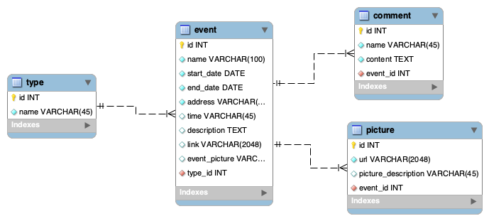

# Austin Events

## Description
This weekends project we were tasked with making an event tracker of our choosing. I chose to make a application to track local arts/musical events in Austin Texas. The user can see events and their information, create/update/delete an event.

## HOW TO USE
A list of all of the events on our data system is displayed on the home page, along with a form to create an Event. When you submit the Create Event form it adds the event to the list above dynamically(Creating an event requires all form fields to be filled out). To view an event's details, you click on the either the event date or name.

## Route Mappings
| HTTP Verb | URI                  | Request Body |
|-----------|----------------------|--------------|
| GET       | `/api/events`    | Get all 'Events' |
| GET       | `/api/events/{id}` | Get 'Event' by id |
| POST      | `/api/events`    | Create new 'Event' |
| PUT       | `/api/events/{id}` | Update 'Event' |
| DELETE    | `/api/events/{id}` | Delete 'Event' by id |
| GET       | `/api/events/{id}/comments`    | Get all 'Comments' |
| POST       | `/api/events/{id}/comments` | Create new 'Comment' |
| DELETE      | `/api/events/{id}/comments/{cid}`    | Delete 'Comment' by id |
| GET       | `/api/events/{id}/pictures`    | Get all 'Pictures' |
| POST       | `/api/events/{id}/pictures` | Create new 'Picture' |
| DELETE      | `/api/events/{id}/pictures/{pid}`    | Delete 'Picture' by id |
| GET       | `/api/types`    | Get all 'Types' |

## Technologies Used
* Java
* JavaScript
* Spring JPA
* Spring Boot
* Git
* Gradle
* MySQL
*Angular
*TypeScript

## Database

## Lessons Learned
To create a RESTful application with CRUD functionality. We also learned how to create Service classes and Repository methods to personalize the tools we already get with Spring JPA. 

I learned that in order to pass the id of the event im wanting to preform any CRUD operations i need to assign the button id the index of the current event in the array of events it is added to when created. This created some what of a head ache when trying to trouble shoot, but using the console to print the values was very helpful when tracking what function i was in and what function i wasnt making it to.

I learned to not use common keywords as variable names, doing so can cause complications when they clash with file imports and classes.

I learned that when binding inputs to specific fields requires name attribute in the tag when creating an event item.

